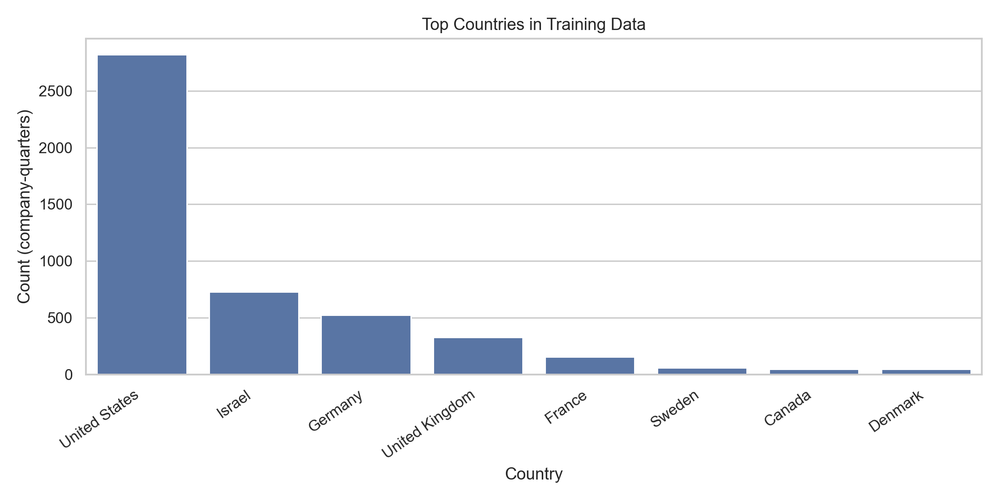
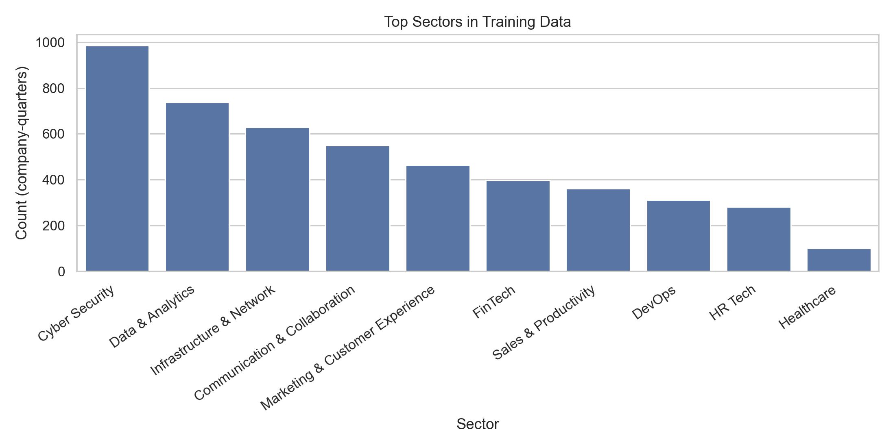
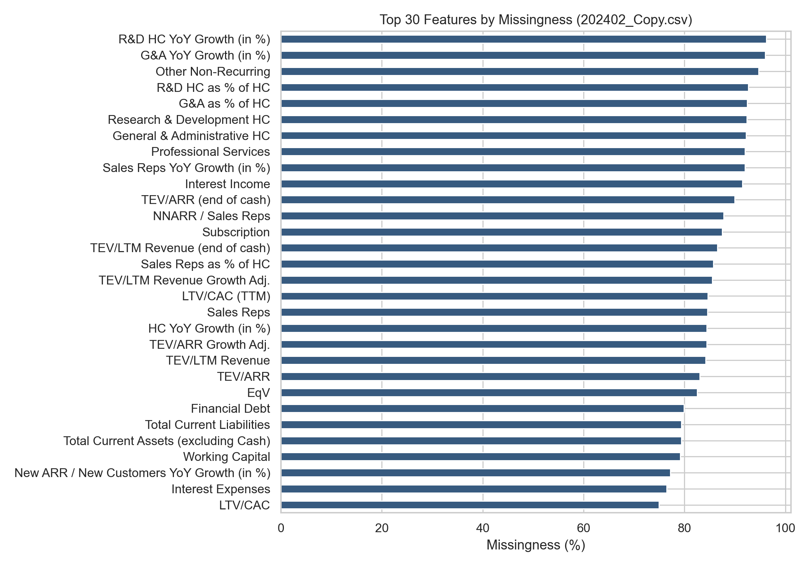
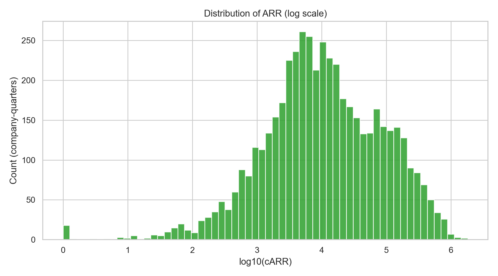
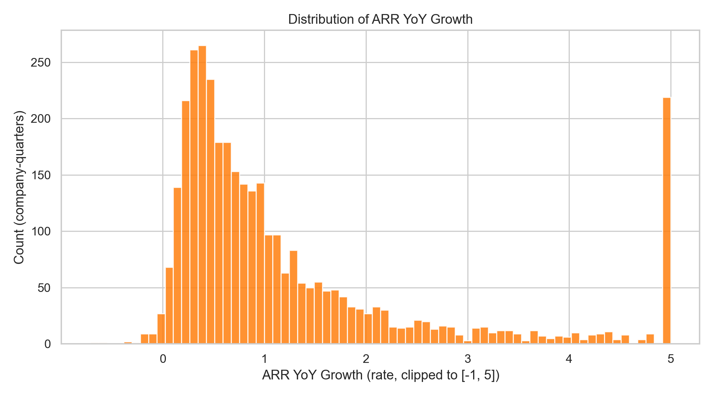
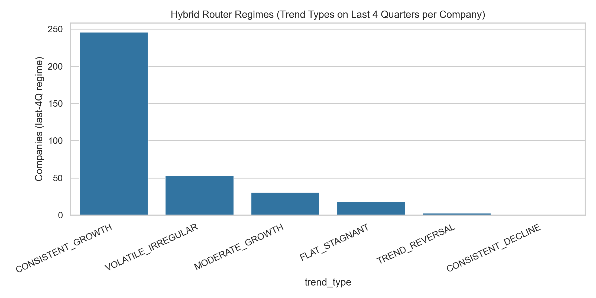
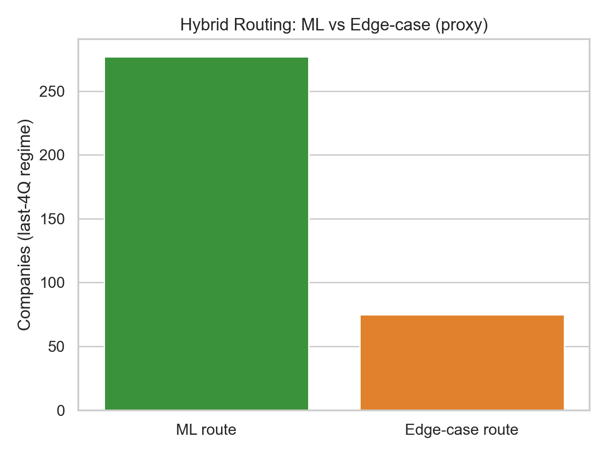
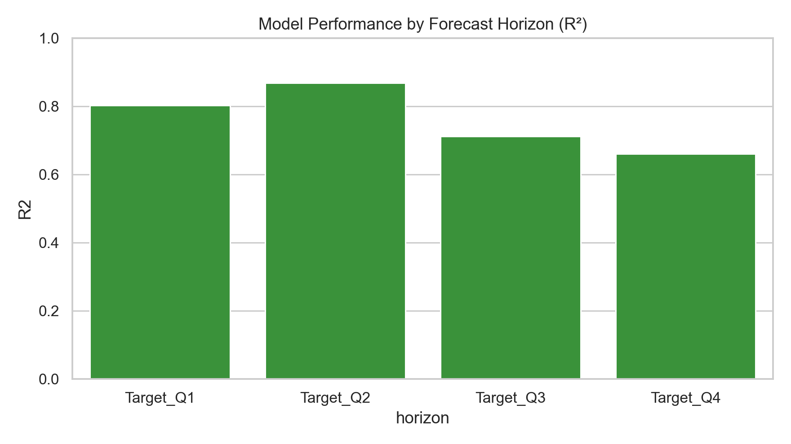
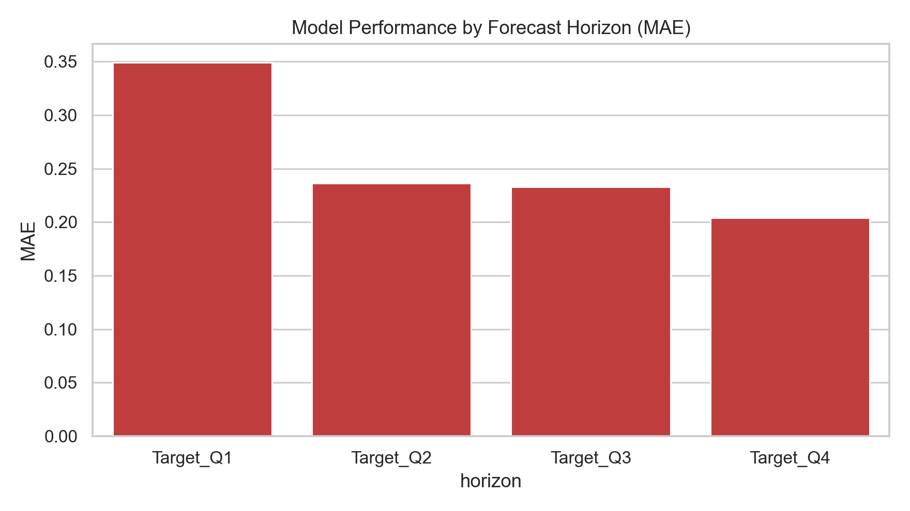
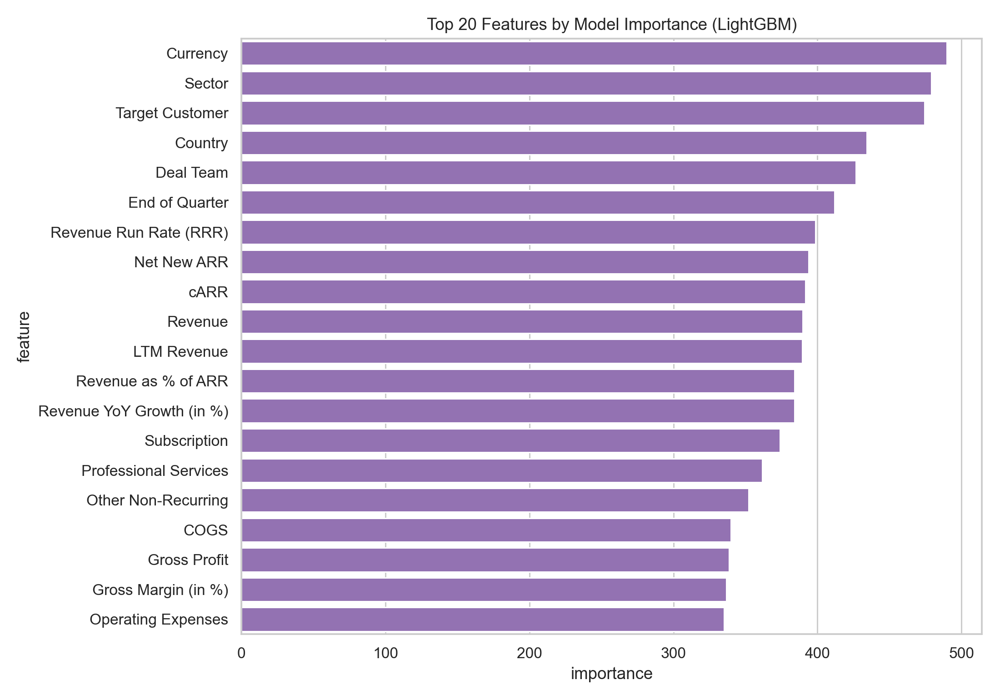

## Executive Summary

Venture capital (VC) investment decisions are made under extreme uncertainty. Early-stage companies often lack stable financial histories, and the available data is sparse, heterogeneous, and biased toward specific geographies and sectors. This project delivers a **production-oriented forecasting system** that predicts a startup’s **next four quarters of ARR (Annual Recurring Revenue)** using a LightGBM-based model, while explicitly addressing the core constraint of real-world usage: **users cannot provide 100+ structured features** at prediction time.

The shipped system consists of:

- **Tier-based input contract**: users provide a minimal set of inputs (Tier 1) and optional advanced metrics (Tier 2).
- **Intelligent Feature Completion**: the system constructs a realistic full feature vector by identifying similar companies in the historical dataset and imputing missing metrics using robust statistics.
- **Hybrid forecasting**: a routing layer detects non-standard trajectories (decline, stagnation, volatility) and falls back to a transparent **Rule-Based Health Assessment** that produces explainable projections using industry benchmarks.
- **FastAPI service**: the system is exposed via production-ready API endpoints for single-company forecasts, batch CSV processing, chat-based explanation, and macro context.

On a held-out test set, the LightGBM model achieves **overall \(R^2 \approx 0.7966\)**. Performance varies by horizon (e.g., \(R^2 \approx 0.80\) for the nearest quarter and \(R^2 \approx 0.66\) for the fourth quarter ahead), which is expected for multi-step forecasting in volatile startup environments. Predictions are returned with a pragmatic **±10% decision-support range** to help VC users reason about risk and scenario bounds.

## 1. Problem Statement and Success Criteria

### 1.1 Prediction task

Given a company’s recent ARR trajectory (four quarters), headcount, and sector (plus optional Tier 2 metrics), forecast:

- **Q+1 to Q+4 ARR** (four quarters ahead), and
- Growth diagnostics (QoQ and YoY rates) and uncertainty bounds.

Internally, the core model predicts **YoY ARR growth rates for each of the next four quarters** and converts those into absolute ARR by applying predicted YoY growth to last year’s corresponding quarter.

### 1.2 Real-world constraint: minimal user input

The training dataset contains many features per company-quarter, but a real VC workflow cannot assume that an investor (or founder) will provide that full feature set. The central engineering requirement is therefore:

> Enable high-quality predictions from minimal inputs without producing feature vectors that are out-of-distribution relative to training data.

### 1.3 Success criteria (VC + ML)

- **Accuracy**: strong predictive fit on held-out data (R²/MAE), with horizon-wise reporting.
- **Robustness under missingness**: stable results with Tier 1 only; improved fidelity with Tier 2.
- **Behavior on edge cases**: declining, flat, and volatile companies should not receive unrealistic “high-growth” forecasts.
- **Explainability**: routing decisions and rule-based projections must be auditable for investment decision support.
- **Operational readiness**: API deployment, validation, error handling, and latency appropriate for interactive use.

## 2. Data Overview

### 2.1 Dataset summary (production dataset)

The production model uses `202402_Copy.csv`:

- **Observations**: 5,085 company-quarters
- **Companies**: 354
- **Raw columns**: 122

This dataset is **not iid**: it contains repeated measures per company and reflects venture-backed dynamics (high growth, volatility, down periods, and reporting inconsistency).

### 2.2 Bias and representativeness

The dataset is geographically concentrated (US and a small set of other ecosystems dominate). A representative snapshot is shown in the country distribution figure.



Sectors are also concentrated in software/tech verticals. The production API further constrains sectors to a consolidated list for validation and robustness.



### 2.3 Missingness and why it matters

Many features are sparse (often missing in 80–90%+ of rows). This strongly influences both model training and system design.



Key implication: naïve “fill missing with 0” at inference creates unrealistic inputs and causes distribution shift. This observation directly motivated **Intelligent Feature Completion**.

### 2.4 Heavy tails and volatility

ARR and growth metrics are heavy-tailed, spanning orders of magnitude. This motivates:

- logarithmic similarity for peer matching,
- robust feature imputation (weighted medians), and
- a hybrid path for non-standard trajectories.





## 3. System Architecture (End-to-End)

### 3.1 Production dataflow

The production API integrates a small number of “active” modules:

1. Request validation (FastAPI + Pydantic)
2. Tier-based input parsing
3. Trend detection and routing
4. Either:
   - (A) ML route: intelligent feature completion → LightGBM prediction, or
   - (B) Edge-case route: rule-based health assessment projection
5. Post-processing: QoQ, YoY, scenario bounds (±10%), response formatting

### 3.2 API surface

Core endpoints:

- `POST /tier_based_forecast`: main forecast endpoint
- `POST /predict_csv`: batch forecasts from CSV upload
- `POST /chat`: conversational explanation + analysis tools
- `GET /makro-analysis`: macro indicators (VIX/MOVE/BVP/GPRH)
- `GET /health`, `GET /model_info`: system diagnostics

## 4. Tier-Based Input Contract

### 4.1 Tier 1 (required)

Tier 1 is designed for the minimum information that is typically obtainable during diligence:

- Q1–Q4 ARR (most recent four quarters)
- headcount
- sector (constrained to a validated set)

### 4.2 Tier 2 (optional)

Tier 2 allows a user to increase forecast fidelity where available:

- gross margin
- sales & marketing spend
- cash burn
- customers
- churn rate
- expansion rate

This tiering prevents the system from failing when a metric is missing while still rewarding higher-quality inputs.

## 5. Intelligent Feature Completion (Core Contribution)

### 5.1 Why feature completion is necessary

The LightGBM model expects a full engineered feature vector. If a user provides only Tier 1, most features would be missing at inference. Simple imputation (zeros/global means) produces vectors that are not representative of the training distribution, harming performance and trust.

### 5.2 Similarity matching

The completion system finds a cohort of similar companies using:

- **logarithmic similarity on ARR** (robust to scale),
- similarity on growth proxies, and
- similarity on headcount.

It then selects the **top 50** nearest companies as a peer set.

### 5.3 Robust inference via weighted median

For each missing feature, values are inferred from the peer set using a **weighted median** (weights = similarity score). This improves robustness under heavy-tailed feature distributions typical in startup metrics.

### 5.4 Default priors by ARR scale

If a feature is absent even in the peer set (or fails type conversions), the system falls back to size-dependent defaults (small/growth/large ARR regimes). This avoids pathologies such as negative headcount or implausible margins.

## 6. Hybrid Forecasting: ML Route + Rule-Based Health Assessment

### 6.1 Why a hybrid system exists

A pure ML system trained predominantly on growth regimes can produce unrealistic outputs for:

- consistent decline,
- flat/stagnant revenue,
- highly volatile patterns, and
- trend reversals.

This is a classic distribution shift problem: the ML model has limited exposure to these regimes and is optimized for typical growth dynamics.

### 6.2 Trend detection and routing (6-factor analysis)

A dedicated routing layer analyzes the last four quarters using:

- overall Q1→Q4 growth,
- QoQ sequence,
- recent momentum (Q3→Q4),
- consistency,
- volatility,
- acceleration/deceleration.

This generates a trend label (e.g., CONSISTENT_GROWTH, CONSISTENT_DECLINE, VOLATILE_IRREGULAR) and determines whether to route to the edge-case method.





### 6.3 Rule-based health assessment (edge-case method)

When the router detects an edge case (or Tier 2 indicates poor fundamentals such as short runway), the system uses a deterministic, benchmark-driven method that:

- computes health metrics (ARR growth, NRR, CAC payback, Rule of 40, runway),
- assigns a health tier (HIGH / MODERATE / LOW), and
- projects ARR forward using conservative growth/decline rules.

This yields an explainable forecast suitable for investment committees and post-investment monitoring.

## 7. Model: LightGBM Multi-Output Forecasting

### 7.1 Model choice

LightGBM is chosen due to:

- strong performance on tabular data,
- ability to capture nonlinear interactions,
- efficient inference for API serving,
- robustness under engineered features.

### 7.2 Forecast horizons and evaluation

Model performance by horizon:





### 7.3 Feature importance

The top importance features provide partial interpretability and sanity checks (e.g., ARR growth and efficiency metrics should matter in SaaS).



## 8. Uncertainty Quantification (Decision-Support Range)

All forecasts return three scenarios:

- pessimistic: \(-10\%\)
- realistic: model projection
- optimistic: \(+10\%\)

This is implemented as a pragmatic **scenario band**, not a calibrated statistical prediction interval. The intent is to provide:

- a risk-aware range for VC decision-making, and
- a consistent communication format for founders and investors.

Future iterations should calibrate this band based on historical residual distributions (e.g., empirical 10th/90th percentile errors by ARR regime and horizon).

## 9. Macroeconomic Context Module

The system provides macro indicators via `GET /makro-analysis`:

- **VIX**: equity volatility / risk sentiment
- **MOVE**: rates volatility (funding conditions)
- **BVP Cloud Index**: public cloud/software valuation proxy
- **GPRH**: geopolitical risk

These indicators are used as **context**, not as causal features in the core ARR model. The goal is to present the forecast alongside market regime information, improving interpretation and decision quality.

## 10. Limitations and Threats to Validity

- **Sampling bias**: dataset is concentrated in specific geographies and software sectors; generalization is strongest for similar companies.
- **Missingness**: many metrics are not consistently reported; imputation introduces uncertainty and potential bias.
- **Heuristic uncertainty**: ±10% band is not calibrated; it should be validated per segment/horizon.
- **Regime shift**: model performance may degrade under structural changes (rates, GTM shifts, competitive dynamics).
- **Similarity assumptions**: “nearest companies” may not reflect true similarity for unique businesses; the system can inherit peer group bias.

## 11. Conclusion

This project delivers a production-ready ARR forecasting system for venture capital workflows. The core contributions are:

- a tiered input interface that matches real diligence constraints,
- a similarity-driven feature completion approach to prevent out-of-distribution inference,
- a hybrid routing architecture that prevents unrealistic forecasts for edge cases via explainable, benchmark-driven projections,
- a deployed FastAPI surface including batch prediction, chat-based explanations, and macro context.

The system demonstrates strong predictive performance (\(R^2 \approx 0.80\)) while prioritizing robustness and interpretability—two requirements that determine whether ML forecasting tools are usable in real investment practice.

---

### Appendix A. How to reproduce figures

From the repo root:

```bash
python3 report/generate_figures.py
```

Figures are written to `report/figures/`.

